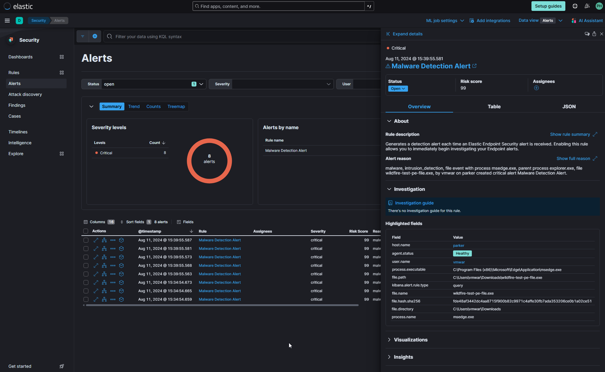
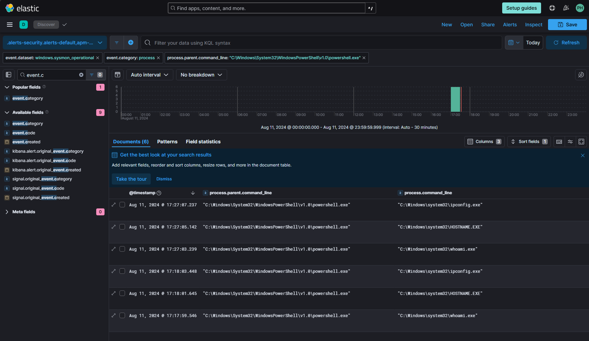

# Elastic Stack: Advanced Threat Detection and Response

This project showcases my ability to deploy and manage complex cybersecurity environments, simulate advanced attack scenarios, and configure sophisticated detection mechanisms using Elastic Stack. My work with tools like Zeek, Sysmon, and PowerShell, combined with a strong focus on log analysis and alerting, highlights my preparedness to address real-world security challenges in a professional setting.

**1. Set Up and Managed Virtual Environments**:
  - Configured three virtual machines:
    - **Ubuntu Box**: Installed and configured Zeek for network security monitoring.
    - **Windows Victim Box**: Used to generate logs and serve as the target for simulated attacks.
    - **Kali Box**: Deployed to conduct offensive security operations against the Windows machine.

    

**2. Network Security Monitoring with Zeek**:
  - Installed and configured Zeek on the Ubuntu system to monitor network traffic and analyze logs for suspicious activities.

  

**3. Log Management and Analysis with Elastic**:
  - Integrated various agents into Elastic to centralize log collection, management, and analysis, ensuring comprehensive visibility into the network environment.

  
  

**4. Malware Testing and Alert Generation**:
  - Downloaded and deployed WildFire malware to simulate a real-world threat scenario, generating alerts within Elastic. This process demonstrated the capability of Elastic SIEM in detecting and responding to malicious activities.

  
  
  
  

**5. Data Querying and Analysis**:
  - Leveraged Elastic's query language to analyze security alerts and logs, focusing on identifying potential threats and anomalies within the environment.

  
  

**6. Enhanced Security Visibility with Sysmon**:
  - Implemented Sysmon on the Windows system to capture detailed system activity logs, significantly improving visibility into PowerShell activity and other critical system events.

  
  
  

**7. PowerShell Command Visibility Enhancement**:
  - Executed PowerShell commands to query and analyze results, ensuring a robust security posture.
  - Modified Windows Group Policy settings to further enhance the logging and visibility of PowerShell commands, contributing to more effective threat detection and investigation.

  
  

## Attack Scenarios

### 8. Attack Scenario 1: Web Server Exploitation
- Simulated an attack on a Python-based web server using tools like Nmap, Nikto, and OWASP ZAP.
- Developed and implemented custom query alerts within Elastic to detect the attack patterns, setting thresholds and triggers based on the MITRE ATT&CK framework.
- Successfully detected, triggered, and reviewed alerts in Elastic, validating the effectiveness of the monitoring setup.

### 9. Attack Scenario 2: Reverse Shell Exploitation
- Created a reverse shell payload using Msfvenom, served through a Python HTTP server on Parrot OS.
- Crafted and executed a PowerShell script within a batch file on the Windows victim box to pull and execute the reverse shell, gaining access and validating the attack.
- Developed detection rules in Elastic to:
  - Identify batch files in HTTP traffic on unusual ports.
  - Detect PowerShell executions initiated by batch files.
  - Monitor for PowerShell Invoke-WebRequest actions downloading batch files.
  - Recognize potential Msfvenom payload executions.
-Executed the same attack scenarios from before, confirming the robustness of the detection rules as the alerts were successfully triggered and logged.

